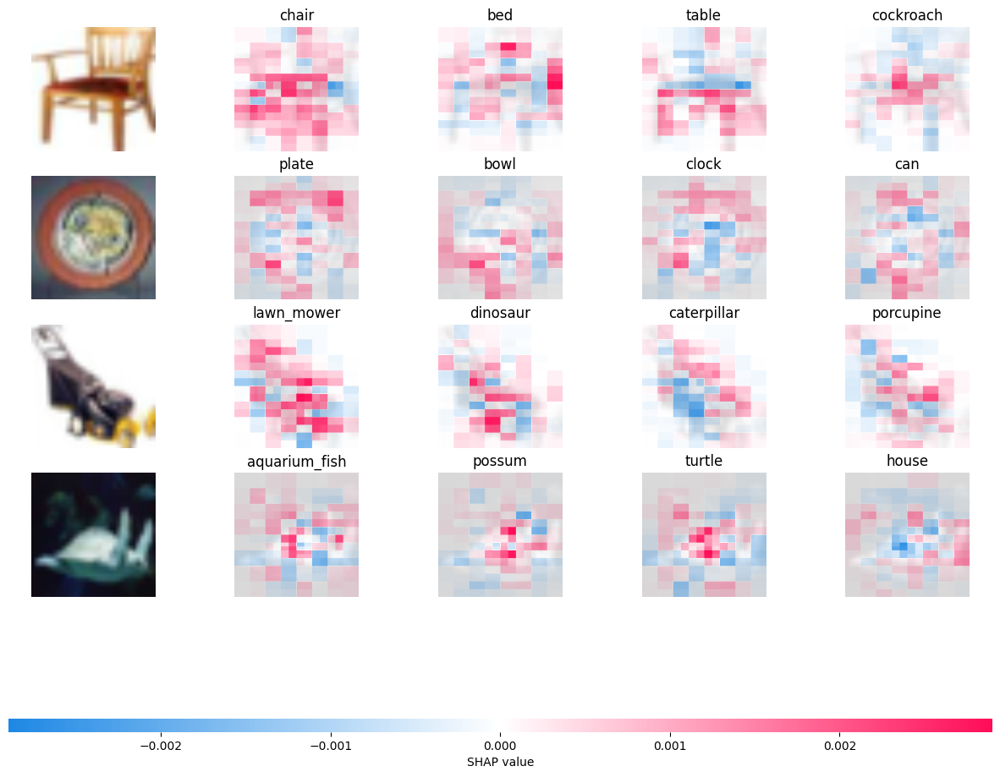

# Bias mitigation using SHAP

## Introduction
Bias in artificial intelligence refers to systematic and unfair favoritism or discrimination that arises in the predictions, decisions, or outputs of AI systems. It often results from skewed data, imbalanced representation, or flawed algorithmic design, leading to unequal outcomes.

Bias Mitigation Enhances AI Systems by:
- Ensuring diverse and representative data collection and curation.
- Incorporating fairness constraints in model design and learning algorithms.
- Using auditing tools and explainability techniques to detect and correct bias.

## SHAP

[SHAP](https://github.com/shap/shap) is a popular library in Python used to explain the output of machine learning models. It provides interpretability by assigning Shapley values from cooperative game theory to each feature, indicating its contribution to the model’s predictions.

**SHAP Partition Explainer for Bias Mitigation in Image Data**

SHAP's Partition Explainer works for image data and is a good choose to use it in order to provide observations about bias. Since Partition Explainer relies on hierarchical feature clustering - images can be treated as grids of pixels or superpixels (spatially grouped pixel regions). Partitioning the image into regions (like clustering superpixels) helps approximate SHAP values efficiently.

**Visual representation with SHAP**

In SHAP visualizations, the colors like red and blue are used to represent the impact of feature values on the model's output.
- **Red**: red regions contribute **positively or more strongly** to increasing the likelihood of a certain class.
- **Blue**: blue regions typically indicate features contributing to **decreasing** the predicted outcome or a **negative influence** on a specific class probability

## Tutorial
This material present a tutorial of usage SHAP for bias mitigation.

**Dataset**: CIFAR100

**Model**: ResNet18

You can follow the next steps:
1. On **xai_final_create_model.ipynb**, import ResNet18 model and train it 10 epochs on CIFAR100 dataset. At data fetch, the CIFAR100 data is resized to *244 x 244* and normalized. After training is completed, save the model into a *'.pth'*  file
2. On **xai_final_shap.ipynb** import the previously saved model and fetch several CIFAR100 data samples for testing
3. 1. *transform* and *inv_transform* functions are defined to help with data preprocessing before being used for prediction 
	2. pick a sample from the testing set - access it by index, use the model's prediction function on it to obtain the class
	3. create a blur mask that is used for partitioning, then create an explainer using this mask
	4. use the model and the explainer to compute SHAP values for the given image, for a given number of evaluations
	5. the output is represented the 4 most appropriate classes for the used sample, along with the SHAP partitioning results
	6. plot the results

The procedure presented above can the used for multiple samples, instead of one sample at once. Below is an example with 4 images, and SHAP partitioning results after 5000 evaluations

 **Fig. 3 The results of partitioning explainer on 4 images after 5000 evaluations**
